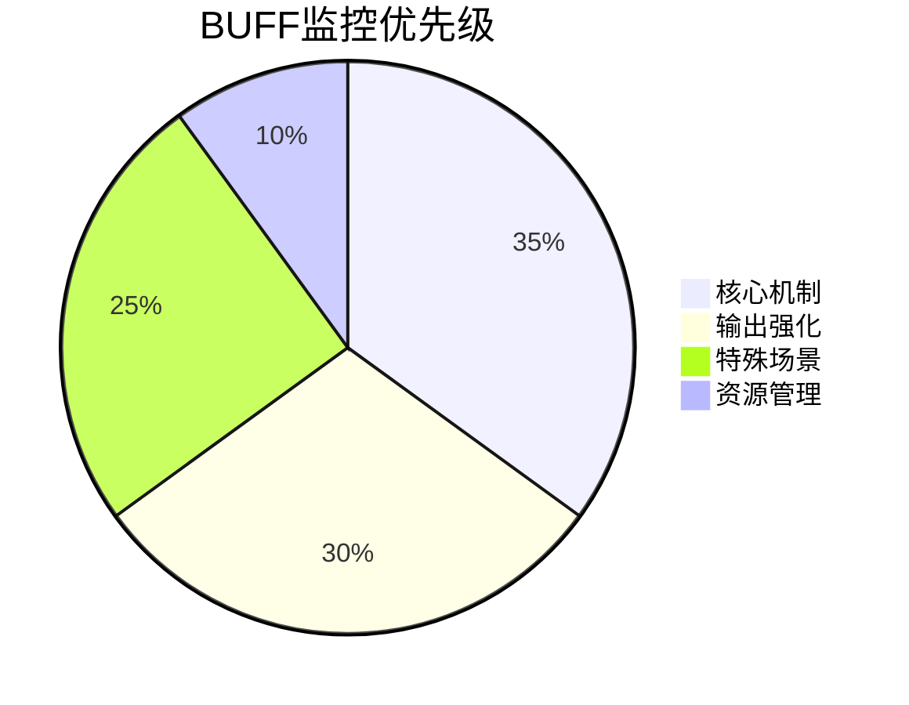

<!--
 * @Author: 马少帅
 * @Date: 2025-04-08 17:39:47
 * @LastEditors: 马少帅
 * @LastEditTime: 2025-04-08 17:39:53
 * ————————————迭代注释——————————
 * @Description: 
-->

以下是对所有BUFF的系统化分类及触发机制的整合表格，包含类型划分、触发条件和效果说明：

---

### 猎人BUFF系统总表
| BUFF类型       | BUFF名称         | 触发方式                  | 主要效果                                                                 | 持续时间/层数       |
|----------------|------------------|---------------------------|--------------------------------------------------------------------------|---------------------|
| **核心机制**   | 雄鹰印记         | 消耗弹无虚发时30%概率触发 | ✅ 减少爆炸射击2秒CD ✅ 被瞄准射击引爆时+15%伤害                        | 15秒                |
|                | 弹无虚发         | 瞄准射击命中获得          | 🎯 使多重/奥术射击可消耗层数 🔺 每层提升对应技能10%伤害                 | 可叠加3层（无时限） |
|                | 行云流水         | 急速射击期间每秒+消耗弹无虚发 | ⏳ 每层减少瞄准射击0.3秒读条（3层最大）                                   | 10秒（可刷新）      |
| **输出强化**   | 子弹风暴         | 急速射击激活期间          | 💥 瞄准射击伤害+40% ⚡ 暴击时额外获得5集中值                            | 与急速射击同步      |
|                | 技巧射击         | 多重射击命中≥3目标        | 🔄 下个瞄准/急速射击弹射3目标                                             | 15秒                |
|                | 皎月风暴         | 急速射击持续期间          | 🌪️ 自动射击间隔-20% 🔄 15%概率触发子弹风暴                               | 同急速射击持续时间  |
| **资源管理**   | 集中爆发         | 急速射击激活              | ⚡ 每秒恢复20集中值                                                       | 同急速射击持续时间  |
|                | 弹药装填         | 荷枪实弹（被动）          | 🔄 自动射击30%概率填充1层弹无虚发                                          | 被动常驻            |
|                | 战术冷却         | 稳固射击命中              | ⏳ 自身CD-1.5秒                                                           | 即时生效            |
| **特殊场景**   | 百发百中增益     | 开启百发百中              | 🔥 暴击率+25% ⏲ 急速射击重置概率+30%                                    | 15秒                |
|                | 乱射锁定         | 乱射激活期间              | 🔒 技巧射击不消耗 💣 每2秒自动发射爆炸射击                               | 同乱射持续时间      |
|                | 猎人印记         | 手动施加                  | 🔍 目标受伤害+5% 🔄 技巧射击触发时延长5秒                                | 初始20秒（可刷新）  |

---

### 类型说明
1. **核心机制**  
   - 战斗循环基础，直接影响技能联动
   - 需优先监控（如雄鹰印记覆盖率）

2. **输出强化**  
   - 直接提升伤害能力的短期增益
   - 爆发期需叠加使用（如子弹风暴+皎月风暴）

3. **资源管理**  
   - 影响能量循环和技能可用性
   - 需防止溢出（弹无虚发≤3层）

4. **特殊场景**  
   - 特定技能/场景下的强化效果
   - 需配合战术使用（如AOE开乱射）

---

### 优先级矩阵

> **操作原则**：保持核心BUFF > 强化输出窗口 > 利用特殊场景 > 优化资源循环

**行云流水** BUFF 的触发机制与持续时间如下：

### 触发技能
1. **急速射击激活期间**  
   - 每秒自动获得1层
2. **消耗弹无虚发时**  
   - 每次消耗1层弹无虚发获得1层

### 持续时间
- **单层持续时间**：10秒（可刷新）
- **最大层数**：3层（达到上限后新层数会刷新持续时间）

---

### 核心作用
- **效果叠加**：每层减少瞄准射击 **0.3秒读条时间**（3层时减少0.9秒）
- **优先级**：爆发期需保持3层以最大化输出效率

---

> **使用技巧**：在开启急速射击前确保至少有1层弹无虚发，可快速叠满3层行云流水。

---

**行云流水** BUFF 的触发机制与持续时间如下：

### 触发技能
1. **急速射击激活期间**  
   - 每秒自动获得1层
2. **消耗弹无虚发时**  
   - 每次消耗1层弹无虚发获得1层

### 持续时间
- **单层持续时间**：10秒（可刷新）
- **最大层数**：3层（达到上限后新层数会刷新持续时间）

---

### 核心作用
- **效果叠加**：每层减少瞄准射击 **0.3秒读条时间**（3层时减少0.9秒）
- **优先级**：爆发期需保持3层以最大化输出效率

---

> **使用技巧**：在开启急速射击前确保至少有1层弹无虚发，可快速叠满3层行云流水。